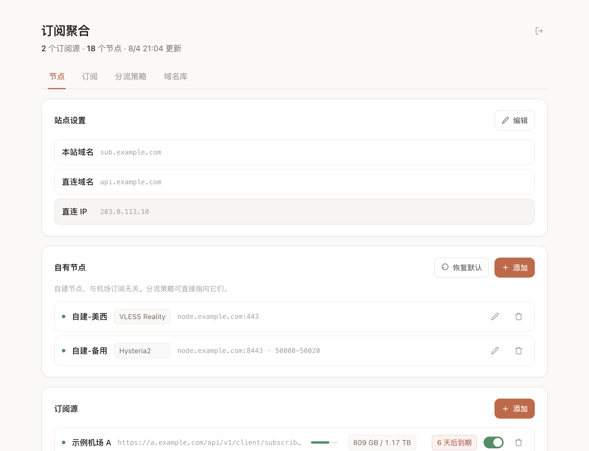
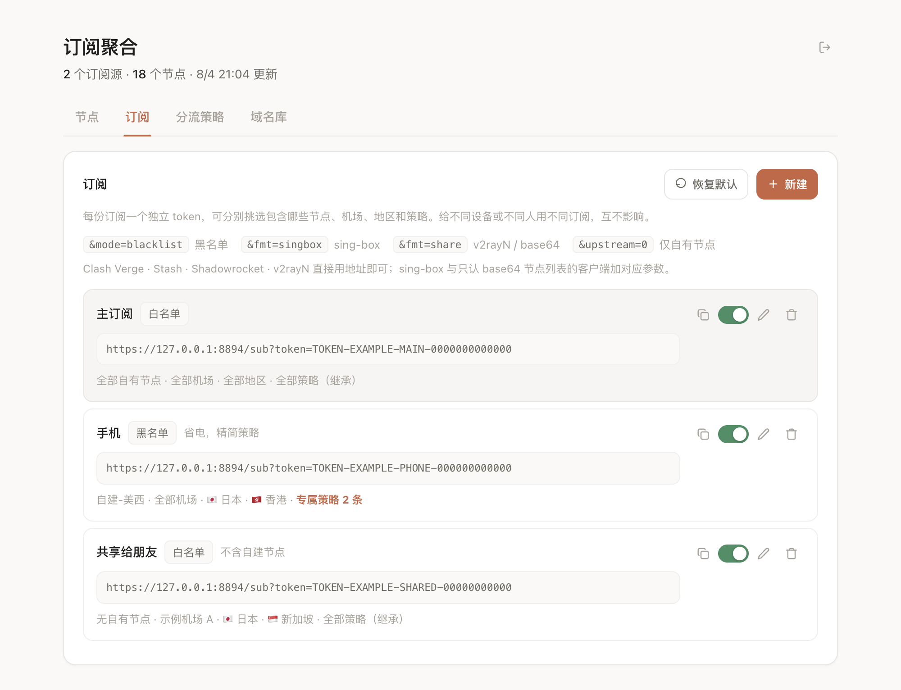
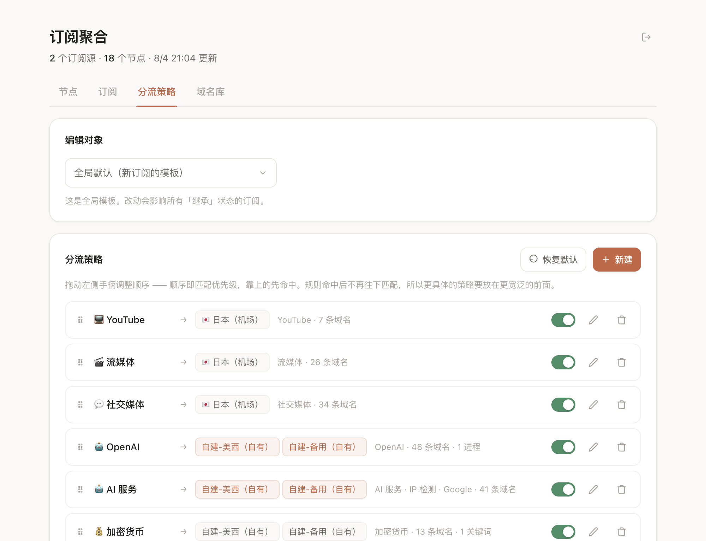
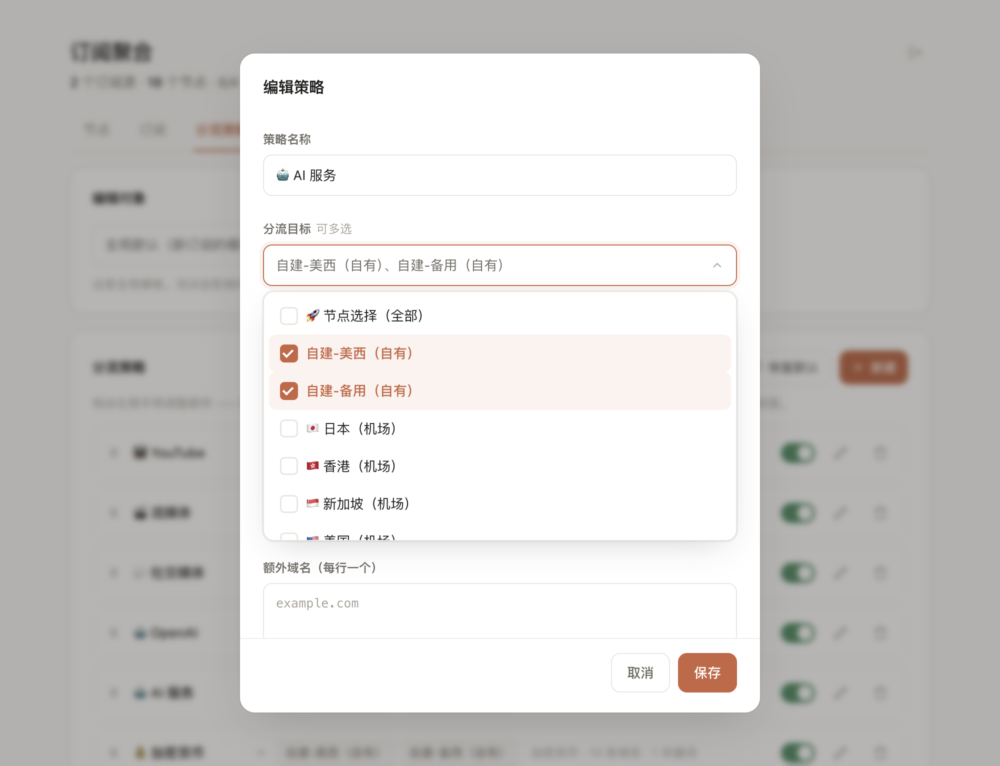

# cf-sub-worker

把自建节点和多家机场订阅聚合成一份，按可视化配置的规则分流下发。整站跑在 Cloudflare Workers 上，配置存 Workers KV，**没有服务器，没有数据库，单文件部署**。

一个 token 一份配置：给手机、电脑、家人各发一份订阅，各自包含哪些节点、走什么分流规则，互不影响。

```
自建节点 ─┐
机场 A  ─┼─→  Cloudflare Worker  ─→  Clash / Shadowrocket / sing-box / v2rayN
机场 B  ─┘         ↕
              Workers KV
```

## 它解决什么

同时用自建节点和机场订阅时，通常要在客户端里手工合并、手工改分流规则，换个设备再来一遍。这个项目把这些收敛到一处：

- **节点聚合** — 多家机场订阅 + 自建节点合成一份，节点按地区重命名成 `🇯🇵 日本 01` 这种统一格式，不再是机场原本的 `2x专线-日本-1|勿跑大流量`
- **分流可配** — AI、流媒体、社交、Apple、Google 等 11 条策略开箱可用，域名库 13 组可增删改，拖拽调整优先级
- **多订阅** — 每份订阅独立 token，可分别挑选包含哪些节点/地区/策略，甚至给每份订阅配一套完全不同的分流规则
- **格式通吃** — 进来认 Clash YAML（单行 flow 与块式缩进）、base64 与明文分享链接列表；出去按客户端下发 Clash YAML / Shadowrocket conf / sing-box JSON / base64 节点列表
- **拉不动也能用** — 机场挡住 Worker 出站时，可以把订阅内容从浏览器复制粘贴进来，走同一套解析并存成快照
- **可观测** — 机场剩余流量、套餐到期倒数直接显示在管理端，抓取诊断会列出每种客户端身份的试拉结果

## 截图

> 截自 `docs/demo.html` —— 一份内置示例数据的静态演示页，用浏览器直接打开即可试玩全部交互，不用部署。

| | |
|---|---|
|  |  |
| 节点页：自建节点、机场源用量与到期、按地区折叠的节点列表 | 订阅页：多份订阅，各自的地址与内容摘要 |
|  |  |
| 分流策略：拖拽排序即调整优先级，可切换编辑对象 | 策略编辑：分流目标可多选，同时指向多个节点 |

## 部署

需要一个 Cloudflare 账号，API token 授予 **Workers Scripts: Edit** 和 **Workers KV Storage: Edit** 两项权限。

```bash
git clone https://github.com/<you>/cf-sub-worker.git
cd cf-sub-worker

export CF_API_TOKEN=...      # My Profile → API Tokens
export CF_ACCOUNT_ID=...     # 控制台右侧栏
bash deploy.sh
```

脚本会自动创建 KV namespace、注入绑定、部署，并打印一个**初始化令牌**。到 Cloudflare 控制台给 Worker 绑一个域名，打开 `https://你的域名/admin`，用该令牌验证身份并设置管理密码。

之后在管理端依次配置：

1. **站点设置** — 填本站域名（用于 DNS 策略与自身直连规则）
2. **自有节点** — 有自建节点就添加，支持 VLESS+Reality 与 Hysteria2
3. **订阅源** — 填机场的订阅链接
4. **订阅** — 默认已有一份，可再建给不同设备用

## 客户端

| 客户端 | 用法 |
|--------|------|
| Clash Verge / Stash / v2rayN | 直接用订阅地址（Clash YAML） |
| Shadowrocket | 直接用订阅地址（按 UA 下发原生 `.conf`）；也可加 `&fmt=shadowrocket` / `&fmt=sr` |
| sing-box | 地址后加 `&fmt=singbox`（UA 含 sing-box 时自动识别） |
| 只认 base64 节点列表的客户端 | 加 `&fmt=share`，此格式不含分流规则 |

其它参数：`&mode=blacklist` 切黑名单模式，`&upstream=0` 应急只下发自有节点。

## 分流策略

策略是有序的，**命中即停止匹配**，所以更具体的要排在更宽泛的前面 —— 比如 `📺 YouTube` 必须在含 `googleapis.com` 的 AI 策略之前，否则 `youtubei.googleapis.com` 会被 AI 规则抢走。默认顺序已排好，拖拽时留意。

每条策略可配：

- **分流目标** — 自有节点 / 机场地区组 / 全部节点 / 直连 / 拒绝，**可多选**：选多个时组内按延迟自动择优，主节点挂了自动切备用
- **严格模式** — 组内只放目标本身，目标不可用即断流。AI 类建议开启：静默回落会让出口悄悄变成机房 IP，比断流更难察觉
- **引用域名集** — 从 13 组内置域名库里选，也可新建；改一处，所有引用它的策略同步生效
- **额外域名 / 关键词 / 进程名** — 策略私有的补充规则

每份订阅的策略可以是「继承全局」或「专属」。专属模式下持有一份完整副本，目标、域名、顺序都与全局无关 —— 典型用法是全局 AI 走美西住宅出口，手机订阅的同名策略改指日本节点。

## 机场元信息

流量与到期优先读 `Subscription-Userinfo` 响应头，缺失时从节点名里的公告文本兜底解析。已覆盖的写法：

- 日期 `2026-08-10` / `2026/08/10` / `2026年8月10日`
- 流量 `剩余流量：809.16 GB` / `剩余: 100GB` / `Remaining: 50 GB` / `已用 390.8GB` / `390.8GB/1200GB`
- 天数 `距离下次重置剩余：7 天`（不会误判为到期）/ `剩余 30 天`
- 单位 GB/TB/MB、简写 G/T、GiB 均按二进制换算；时间戳秒与毫秒自动归一

解析不到就留空，不猜。公告识别做了精确匹配，`香港原生IP-1|勿跑大流量` 这类含「流量」二字的正常节点名不会被误吞。

## 数据

全部存 Workers KV（绑定名 `CONF`）。**代码里不含任何站点信息**，clone 下来就是干净的。

| key | 内容 |
|-----|------|
| `settings` | 本站域名、额外直连域名与 IP |
| `nodes` | 自有节点 |
| `upstreams` | 机场订阅源 |
| `overrides` | 节点级重命名 / 停用 |
| `profiles` | 订阅档案，一个 token 一份；`policies` 为 `'inherit'` 或专属策略数组 |
| `policies` | 全局分流策略，数组顺序即优先级 |
| `lib` | 自定义域名集，与内置 `PRESETS` 合并 |
| `cache:nodes` | 机场拉取缓存，1 小时新鲜期，7 天兜底 |
| `auth:password` / `auth:secret` | 管理端凭据 |

各 `DEFAULT_*` 常量只是首次初始化的种子，KV 有值就以 KV 为准。

## 开发

```bash
node test/run.cjs     # 669 项断言
bash deploy.sh        # 部署
```

`worker.js` 单文件承载全部逻辑 —— Workers 部署一个 JS 文件最省事，也免去打包步骤。改完先跑测试再部署。

测试覆盖 Clash YAML / Shadowrocket conf / sing-box JSON 三种输出格式的合法性与引用完整性、三种入站格式的等价性、规则优先级、目标解析回退、机场元信息多格式解析、多订阅裁剪、粘贴导入与失败措辞、以及一组管理端 UI 的静态断言。最后一组是从踩过的坑固化来的。

## 踩过的坑

**规则顺序敏感。** 命中即停，具体的必须在宽泛的前面。测试里有对应断言。

**TUN 模式必须开 sniffer。** 客户端若用自带 DoH（Chrome Secure DNS 等）绕过 `dns-hijack`，Clash 在 TUN 层只看得到 IP，所有 `DOMAIN-SUFFIX` 规则会**静默失效**、全部落到兜底。开启后从 TLS SNI 还原域名。

**DNS 防泄漏靠 `respect-rules`。** 少了它，代理域名的 DNS 查询会在本地明文发出。同时 `proxy-server-nameserver` 必须直连，否则与它循环依赖。

**IPv6 分享链接要包方括号。** `hysteria2://pwd@[2001:db8::1]:5021`，漏了客户端整条导入失败。

**机场会拦 Cloudflare Workers 的出站请求。** 自己浏览器打开好好的订阅链接，Worker 去拉就是 403 —— 尤其在机场也用 Cloudflare 时（Orange-to-Orange）：出口是 CF 的 ASN，请求还被平台强制加上 `CF-Worker` 头，机场侧一条 WAF 规则就能全挡掉，这个头代码里删不掉。所以换几种客户端 UA 重试只能救一部分，真正的兜底是从浏览器复制订阅内容粘贴进来。

**转不出 outbound 的节点必须连分组引用一起剔除。** sing-box 遇到不存在的 outbound 是拒绝加载整份配置，不是跳过那几个。`toSB` 认不出的协议若只 `filter(Boolean)` 掉，地区组却仍按全量节点取名字，整份订阅就废了 —— 少几个节点还能用，配置非法一点都不能用。

**免费版 Workers 单次请求只有 10ms CPU。** 完整 Clash 配置里 `rules` 能占九成行数，既没节点也没公告，扫它就是白烧预算。解析扫到 `rules:` 就停。

**弹窗退场动画不能复用入场的 animation-name。** 同名时浏览器不重启动画，`animationend` 永不触发，遮罩会一直留着把页面点击全吞掉。

**多行对齐要用 subgrid。** 每行各自 `display:grid` 时列宽只在行内计算，行与行不共享，内容一变就错位。

**部署后有数秒边缘传播延迟。** 验证前先等 30 秒，否则会打到旧版本。另外 PUT scripts 接口若 metadata 不带 `bindings` 会**清空**现有绑定，每次部署都要重新声明 —— `deploy.sh` 已处理。

## License

MIT
